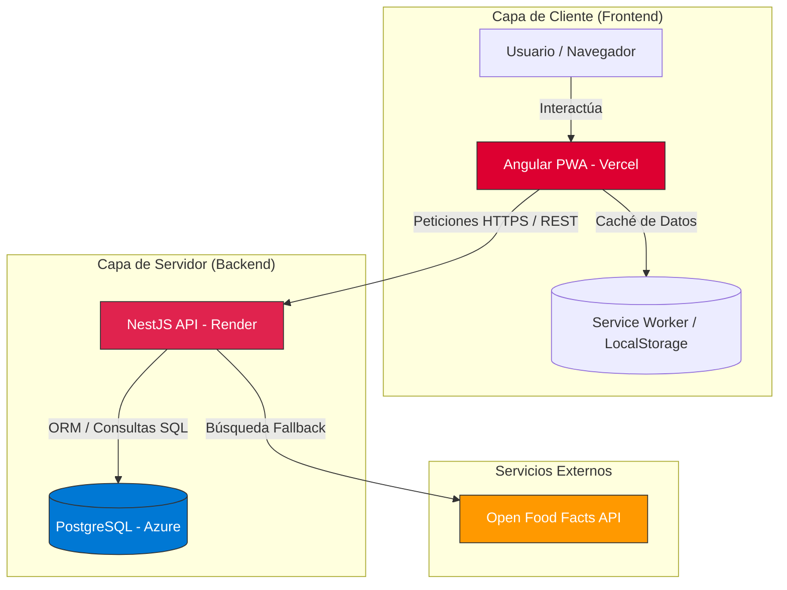

# Plataforma de Gestión Sostenible (GrupoLagos)
Es una Aplicación Web Progresiva (PWA) diseñada para la evaluación técnica de GrupoLagos. Permite a los usuarios analizar la sostenibilidad de productos mediante un escáner en tiempo real y proponer nuevas alternativas ecologicas.

## Instrucciones de Ejecución Local

### Backend (NestJS)
1. Navegar a la carpeta: cd 01-Backend
2. Instalar dependencias: npm install
3. Crear un archivo .env basado en la sección de variables de entorno.
4. Ejecutar en modo desarrollo: npm run start:dev
*Nota: Los datos iniciales pueden cargarse llamando al endpoint POST /api/products/seed.

### Frontend (Angular)
1. Navegar a la carpeta del frontend: cd 02-Frontend
2. Instalar dependencias: npm install
3. Ejecutar servidor local: ng serve
4. Acceder a: http://localhost:4200

## Despliegue e Infraestructura
La aplicación utiliza una arquitectura distribuida para garantizar alta disponibilidad:
* **Frontend:** Desplegado en Vercel.
* **Backend:** Desplegado en Render.
* **Base de Datos:** Instancia de PostgreSQL en Azure (Flexible Server).
* **Mantenimiento:** Cron-job externo para evitar el estado de inactividad (cold start) del servidor gratuito de Render.

	
## Variables de Entorno
### Backend (.env)
* DB_HOST: Host de la base de datos Azure.
* DB_PORT: Puerto (5432).
* DB_USERNAME: Usuario de la base de datos.
* DB_PASSWORD: Contraseña de acceso.
* DB_DATABASE: Nombre de la base de datos (postgres).

### Frontend (environment.ts)
* apiUrl: URL de la API (Produccion en Render o localhost).

## Algoritmos e Inteligencia de Negocio

### 1. Algoritmo de Búsqueda Híbrida (Scanner)
El sistema implementa un flujo de búsqueda en dos niveles para maximizar la disponibilidad de informacion:
* Nivel 1 (Local): Consulta directa a la base de datos relacional en Azure mediante TypeORM.
* Nivel 2 (Fallback): Integración con la API externa de Open Food Facts. Si el producto no existe localmente, el backend lo descarga, analiza su Eco-Score y lo persiste automáticamente en la base de datos local.

### 2. Semáforo de Sostenibilidad e Impacto
Implementacion de logica visual basada en el Eco-Score del producto:
* Sostenible (Verde): Puntuación ≥ 70.
* Medio (Amarillo): Puntuación entre 40 y 69.
* Alto Impacto (Rojo): Puntuación < 40.

### 3. Cálculo de Ahorros e Impacto Ambiental
La plataforma optimiza las decisiones de compra al:
* Categorizar productos según su certificación de sostenibilidad.
* Permitir a los usuarios reportar nuevos productos "Lagos" mediante el módulo de Solicitudes, lo que genera una lista de deseos basada en el impacto social y ecológico positivo.

### 4. Algoritmo de Sustitución Inteligente
Este algoritmo actua como el Core de la optimizacion del sistema, sugiriendo alternativas más responsables en tiempo real:
* Filtro de Categoria: Identifica productos que cumplen la misma función dentro de la misma categoria (ej. "Limpieza").
* Maximizacion de Impacto: Selecciona el producto que ofrece la mayor mejora porcentual en el Eco-Score respecto al articulo original.

### 5. Algoritmo de Mochila Multi-objetivo (Optimización de Presupuesto)
Implementado para gestionar la restricción financiera del usuario mientras se maximiza el beneficio ecologico global de la compra. Utiliza una estrategia Greedy (Voraz) basada en la eficiencia de cada peso invertido

Logica de Recorte: Cuando el total de la lista excede el presupuesto definido, el sistema identifica y sugiere eliminar el producto con el ratio mas bajo (el menos eficiente) para equilibrar la mochila financiera sin sacrificar excesiva sostenibilidad.

## Uso de IA
Este proyecto contó con la asistencia de Gemini para:
Arquitectura de Datos: Diseño y normalización de las tablas products y solicitudes en Azure PostgreSQL.
Refactorización UI: Implementación de un diseño responsivo Mobile-First que transforma tablas de datos en tarjetas interactivas para una mejor experiencia en telefonos moviles.
Troubleshooting: Resolución de errores de compilación de TypeScript y configuración de CORS para la comunicación entre Vercel y Render.

## Logica de Calculo y Formulas del Dashboard
El Dashboard de Impacto Sostenible realiza un procesamiento de datos agregados en tiempo real desde la base de datos de Azure:
1. Eco-Score GlobalRepresenta el promedio del desempeño ecológico de todo el inventario registrado.Fórmula: : $90+20+85+50+50+21 = 316$. Dividido por $6 productos, 
resulta en un 52.6% (Redondeado a 53% en interfaz).

2. Indice de Impacto Social Mide el compromiso social promedio (comercio justo y apoyo local) de los productos.Fórmula:  $85+40+95+70+70+70 = 430$. Dividido por $6 productos, 
resulta en un 71.6% (Redondeado a 72% en interfaz).

3. Ahorro Verde EstimadoProyección economica basada en la preferencia por productos con impacto positivo en lugar de alternativas convencionales.
Se asigna un factor de ahorro simbólico de $150 por cada producto analizado y registrado, incentivando el crecimiento de la base de datos sostenible.Calculo Actual: $6 por $150 = $900.

## Capacidades de Aplicacion Web Progresiva (PWA)
Para cumplir con el requerimiento de innovación y acceso en movilidad, la plataforma ha sido convertida en una PWA:
* Modo Offline: Gracias a los Service Workers, el inventario y la lista de compras son accesibles sin conexion a internet.
* Instalabilidad: Puede añadirse a la pantalla de inicio en dispositivos iOS y Android como una aplicacion nativa.
* Persistencia: Utiliza localStorage y caché de datos para garantizar que la lista optimizada del usuario no se pierda al cerrar el navegador.

## Pruebas Automaticas
El proyecto cuenta con una suite de pruebas unitarias para garantizar la integridad de los algoritmos críticos (Busqueda Hibrida y Logica de Negocio).

**Ejecutar tests del Backend:**
1. cd 01-Backend
2. npm run test

**Cobertura principal:**
* ProductsService: Validacion de Plan A (DB), Plan B (API External) y manejo de excepciones.
* ProductsController: Validacion de endpoints y flujos de datos.

## Demo en Vivo (Frontend): https://prueba-tecnica-los-lagos-p-o.vercel.app

## Repositorio (Código): https://github.com/PabloOsorioLe/PruebaTecnica-LosLagos-P.O